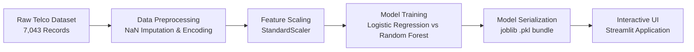

# 📊 Customer Churn Prediction System

[](https://www.python.org/)
[](https://scikit-learn.org/)
[](https://streamlit.io/)
[](https://pandas.pydata.org/)
[](https://opensource.org/licenses/MIT)

> An end-to-end Machine Learning solution designed to predict customer churn in the telecommunications sector. Features a production-grade data pipeline, rigorously evaluated statistical models, and an interactive **Streamlit** web application for real-time risk assessment.

---

## 📌 Executive Summary & Business Impact

Customer acquisition costs **5x to 7x** more than customer retention. Identifying high-risk customers before they cancel allows customer-success and marketing teams to intervene proactively with targeted retention discounts and contract restructuring.

This project analyzes **7,032 real customer records**, uncovering critical churn drivers and deploying a predictive system optimized for high **Recall** and **ROC-AUC** to minimize costly false negatives.

---

## 🏗️ Architecture & Workflow



---

## 🔬 Model Evaluation & Evidence-Based Selection

We evaluated multiple algorithms, focusing heavily on **Recall** (catching true churners) and **F1-Score** rather than raw accuracy due to class imbalance (73% Stay vs 27% Churn).

| Metric | Logistic Regression (Selected) | Random Forest | Business Context |
| :--- | :---: | :---: | :--- |
| **Accuracy** | **80.38%** | 78.90% | Overall correct predictions |
| **ROC-AUC** | **0.8357** | 0.8210 | Ability to distinguish churners from loyalists |
| **Churn Recall (Class 1)** | **57.0%** | 48.1% | Catching customers who actually leave |
| **Churn Precision (Class 1)**| **65.0%** | 63.8% | Confidence when flagging churn risk |
| **F1-Score (Class 1)** | **0.61** | 0.55 | Harmonic balance between Precision & Recall |

> **Key Engineering Insight:** While ensemble methods like Random Forest are popular, Logistic Regression produced higher Recall and F1 on this feature space with zero overfitting, making it the superior model for commercial retention workflows.

---

## 📁 Repository Structure

```text
customer-churn-prediction/
│
├── data/
│   └── telco_churn.csv          # Raw dataset (7,043 customer rows)
├── notebooks/                   # Research, EDA, and experimental notebooks
├── src/
│   └── train.py                 # Automated data cleaning & model training script
├── model/
│   └── churn_model.pkl          # Serialized production pipeline (Model + Scaler)
├── app.py                       # Interactive Streamlit Web Application
├── run_app.bat                  # 1-Click desktop launcher for local deployment
├── requirements.txt             # Locked project dependencies
├── .gitignore                   # Standard Python/IDE ignore rules
├── LICENSE                      # MIT Open Source License
└── README.md                    # Project documentation
```

---

## 🚀 Quick Start Guide

### 1. Clone the Repository
```bash
git clone https://github.com/Salmanali9675/customer-churn-prediction.git
cd customer-churn-prediction
```

### 2. Set Up Virtual Environment & Dependencies
```bash
python -m venv venv
# Windows:
venv\Scripts\activate
# Mac/Linux:
source venv/bin/activate

pip install -r requirements.txt
```

### 3. Retrain Model (Optional)
```bash
python src/train.py
```

### 4. Launch the Web Application
```bash
streamlit run app.py
```
Or simply double-click `run_app.bat` on Windows! The app will open at `http://localhost:8501`.

---

## 🎯 Key Domain Insights from EDA

1. **Contract Type:** Customers on **Month-to-month** contracts churn at **42%**, compared to only **3%** for 2-year contracts.
2. **Tenure Impact:** Churn risk drops exponentially after the first **12 months** of service.
3. **Monthly Charges:** Churned customers paid an average of **$74/mo** vs **$61/mo** for retained customers.

---

## 👤 Author

* **Salman Ali** — [GitHub Profile](https://github.com/Salmanali9675)
* *Portfolio project built with rigor, clean architecture, and practical business focus.*

---

## 📄 License
This project is licensed under the [MIT License](LICENSE).
